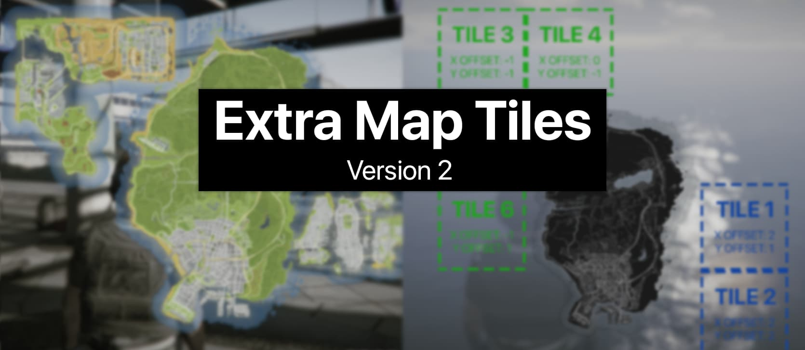
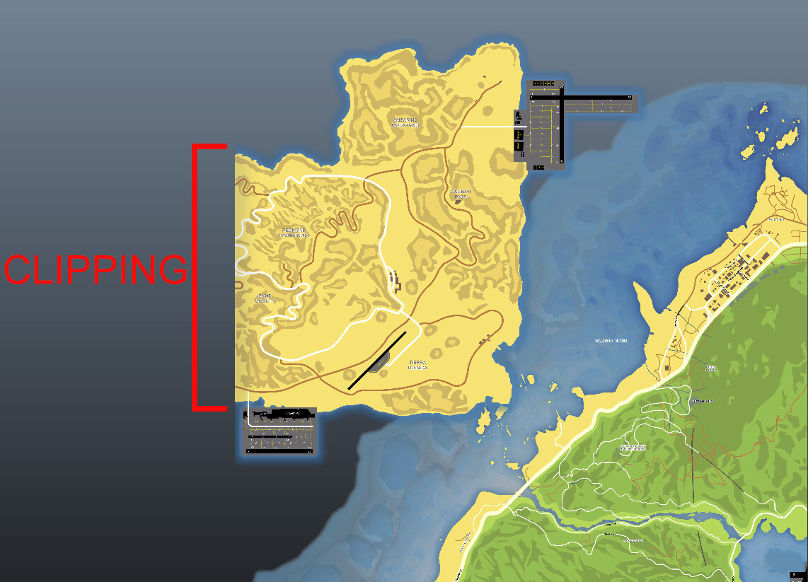
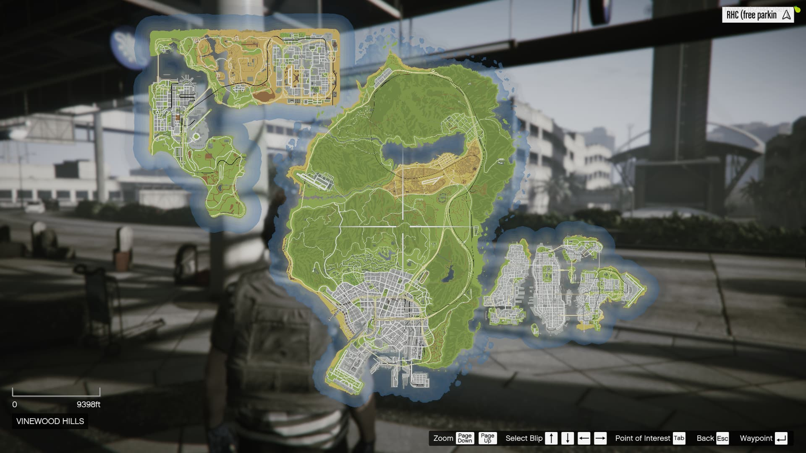
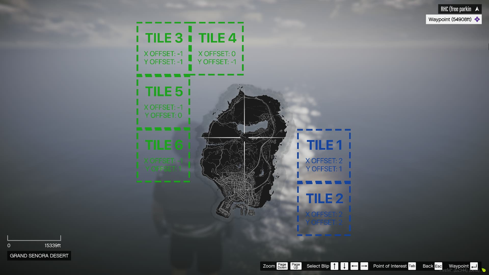
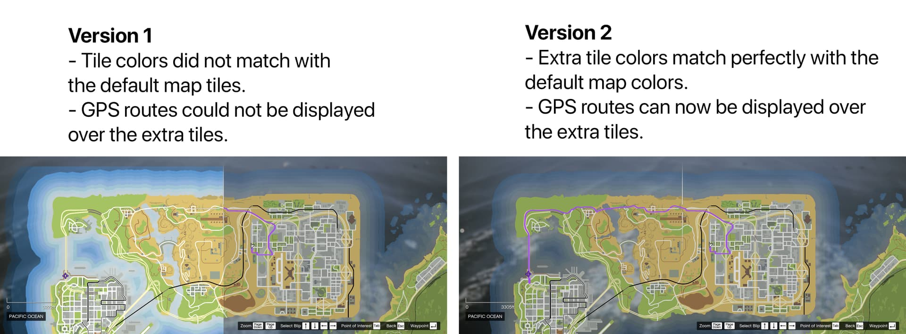
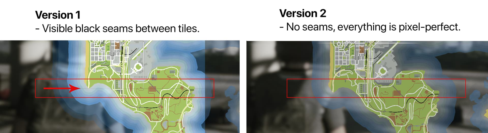
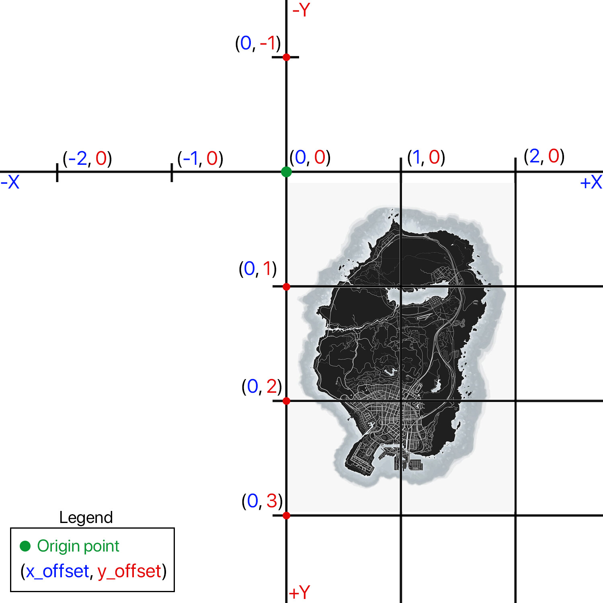
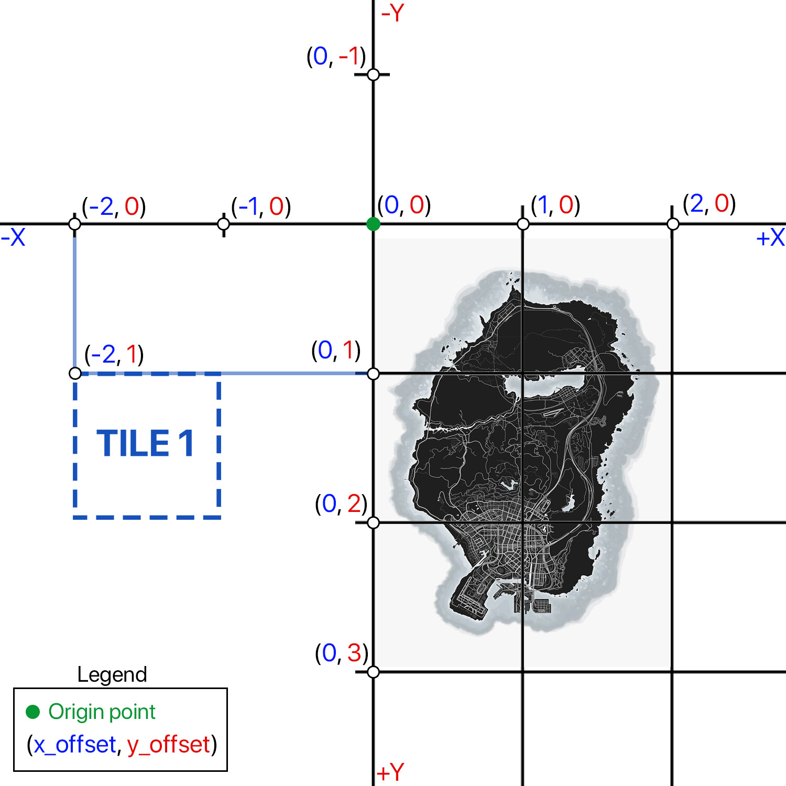
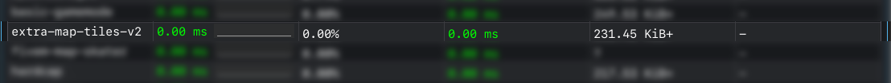
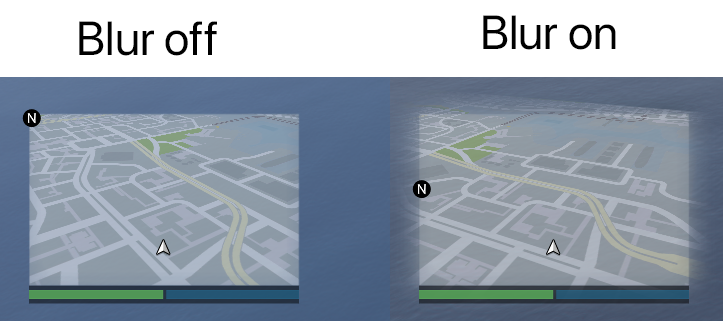

# Extra Map Tiles v2 - Add extra textured tiles on the pause menu map (and minimap) - New and revamped version
# Intro
The GTA 5 pause menu map (and the minimap) is made up of 6 individual tiles forming a `2x3` grid, on which the textures of the in-game world atlas are mapped. For singleplayer modding, users would modify the `minimap.ymt` file, allowing them to add more quadrants beyond this `2x3` grid. FiveM does not support modifying or mounting the `minimap.ymt` file, so workarounds and "hacks" had to be used in order to achieve the same effect.




# Example
As an example, I used the atlas map tiles made by [@LorenVidican](https://forum.cfx.re/u/lorenvidican/summary) for Los Santos, San Fierro, Las Venturas and Liberty City. Parts of these maps also overlap the Los Santos tiles, which I streamed using the *classic* method - replacing the textures in `minimap_sea_0_0.ytd`, `minimap_sea_0_1.ytd`, etc. The rest of the tiles were configured with this resource. The result is the following:



**Note**: This resource does not include any actual graphics besides the placeholder tile images. It also does not modify the minimap zoom or pause menu zoom levels. The resource comes configured like this, as an example:



# Improvements
In October 2023, I posted the first ever resource that lets server developers easily add tiles beyond the `2x3` grid. Since this was the first iteration of the resource, many improvements could still be made. Using a novel Scaleform injection method, we brought multiple enhancements to the original resource, including:

1. Most important - Colors of extra tiles match perfectly with any textures mapped over the default tiles.
2. Also very important - GPS routes are now drawn and visible over any extra tile.



3. Some other refinements - Textures of adjacent tiles are now composed seamlessly, no gaps are visible between tiles.


4. Minor improvements - The pause menu cursor bound extension workaround uses 2 dummy blips instead of 4.

# Setup
In the same way the default tile grid works, this resource places tiles based on offsets. The position of a tile, given 2 offsets (X and Y) is calculated from an origin point. The designers of GTA 5 chose the origin to be the top-left corner of the map. This means that the top-left tile of the default map is at offset `X = 0` and `Y = 0`.

The sign of the offset determines the direction in which to place a tile, while the actual number determines how far (in number of tiles) to place the tile in that direction. (1 unit = 1 tile = 4500 in-game units)


Values for the `X` axis go left to right from positive to negative, while the `Y` axis is inverted. If I wanted to place a new tile that is 2 tiles left of the origin and 1 tile down (remember - the top-left default tile is the origin, marked with green), I would use an `X offset` of  -2 and a `Y offset` of1, as shown in this picture:



The example config file provided with this resource is shown below. The keys of the dictionary (e.g. 1, 2, 3, etc) have to be **unique** and numeric.
- `x_offset` and `y_offset` are the offset values mentioned before and have to be integers (Note: if you are coming from the old resource, the `Y` axis is now flipped, just like in the base game's tiles)
- `txd` represents the name of the YTD file containing the texture. Has to be a string without the `.ytd` extension.
- `txn` is the name of the texture inside the aforementioned YTD file, and has to be a string.
- `visible` is an __optional__ boolean field (true/false) and specifies if the tile is drawn or not when loading the resource on server start.
```
config.tiles = {

    -- 2 example tiles in the south-east of the main map
    [1] = {x_offset = 2, y_offset = 1, txd = "extra_tiles_blue", txn = "tile_1"},
    [2] = {x_offset = 2, y_offset = 2, txd = "extra_tiles_blue", txn = "tile_2"},

    -- 4 example tiles in the north-west of the main map 
    [3] = {x_offset = -1, y_offset = -1, txd = "extra_tiles_green_1", txn = "tile_3", visible = true},
    [4] = {x_offset = 0, y_offset = -1, txd = "extra_tiles_green_1", txn = "tile_4", visible = false},
    [5] = {x_offset = -1, y_offset = 0, txd = "extra_tiles_green_2", txn = "tile_5"},
    [6] = {x_offset = -1, y_offset = 1, txd = "extra_tiles_green_2", txn = "tile_6"},
}
```
Textures can be grouped in a single YTD file (not recommended for big textures) or split between multiple files, but all textures used should have unique names, regardless of where they live.

# Exports 
The resource exposes the following functions that can be called from other scripts to dynamically hide or show tiles at runtime:
- `show_tiles(tiles_list)`: draws all tiles with IDs specified in the parameter. Expects a list. Example call in LUA to draw tiles 1, 2 and 3:
```lua
exports['extra-map-tiles-v2']:show_tiles({1,2,3})
``` 
- `hide_tiles(tiles_list)`: hides all tiles with IDs specified in the parameter. Expects a list. Example call in LUA to hide tiles 1, 2, 3, 4, 5 and 6 (all tiles - note that there is no way to explicitly show or hide all tiles besides calling the functions with a list containing all tile IDs):
```lua
exports['extra-map-tiles-v2']:hide_tiles({1,2,3,4,5,6})
``` 
- `is_tile_visible(tile_id)`: returns true if the tile is visible and false if it is hidden. Example call in LUA to check if tile 3 is visible:
```lua
exports['extra-map-tiles-v2']:is_tile_visible(3)
```
- `refresh_minimap()`: reloads the minimap scaleform if for some reason the minimap and/or main map are blank. Usually this function shouldn't need to be called. Example in LUA:
```lua
exports['extra-map-tiles-v2']:refresh_minimap()
```


# Performance
This resource takes up virtually no CPU cycles - 0.00ms shown on resmon.



# Other information
- Tested on server build 17000 and game build 2944 on 15/01/2026 - fully working.
- Although it is not a good practice, you can use a trial-and-error approach by restarting the resource when configuring tiles - Define the config, change offset values, txd or txn, restart the resource. Changes should take effect after opening and closing the pause menu - no need to restart the client or the server. After you have the tiles at the correct positions, stop and restart the server. Only do this when configuring tiles, never on a live server as it may lead to visual bugs.
- In theory, compatibility with other resources that modify the minimap (circular, square minimaps, etc - not pause menu map) should not be a problem.
- Ideally, your textures should have a 1:1 aspect ratio, in order to not get skewed when mapping to a tile, which has a 1:1 ratio.
- Again, ideally export your textures to DDS DXT5 (aka BC3) format with the maximum number of mipmaps possible for the best clarity and to avoid aliasing artifacts when zooming out the main menu map in-game:


- Depending on the placement of your extra tiles, some minor visual bugs (sharp cutoff of extra tiles) may occur with the minimap's blur mask when the minimap is tiled (i.e. when in a vehicle). The current "solution" is to stream a custom mask that disables the blur. Other workarounds could be writing a script to not tilt the map at all - blur with extra tiles works perfectly fine when on foot. Most of the time this is not even noticeable, I just want to make everything perfect. This feature can be toggled in the config file:




# Support and bug-reporting
If you require any help, have found a bug with this resource, or have a feature request, either leave a reply in the [CFX.re thread](https://forum.cfx.re/t/extra-map-tiles-v2-add-extra-textured-tiles-on-the-pause-menu-map-and-minimap-new-and-revamped-version/5344181), or open an issue here. I read and reply to everything. As always, feedback is very much appreciated. 
